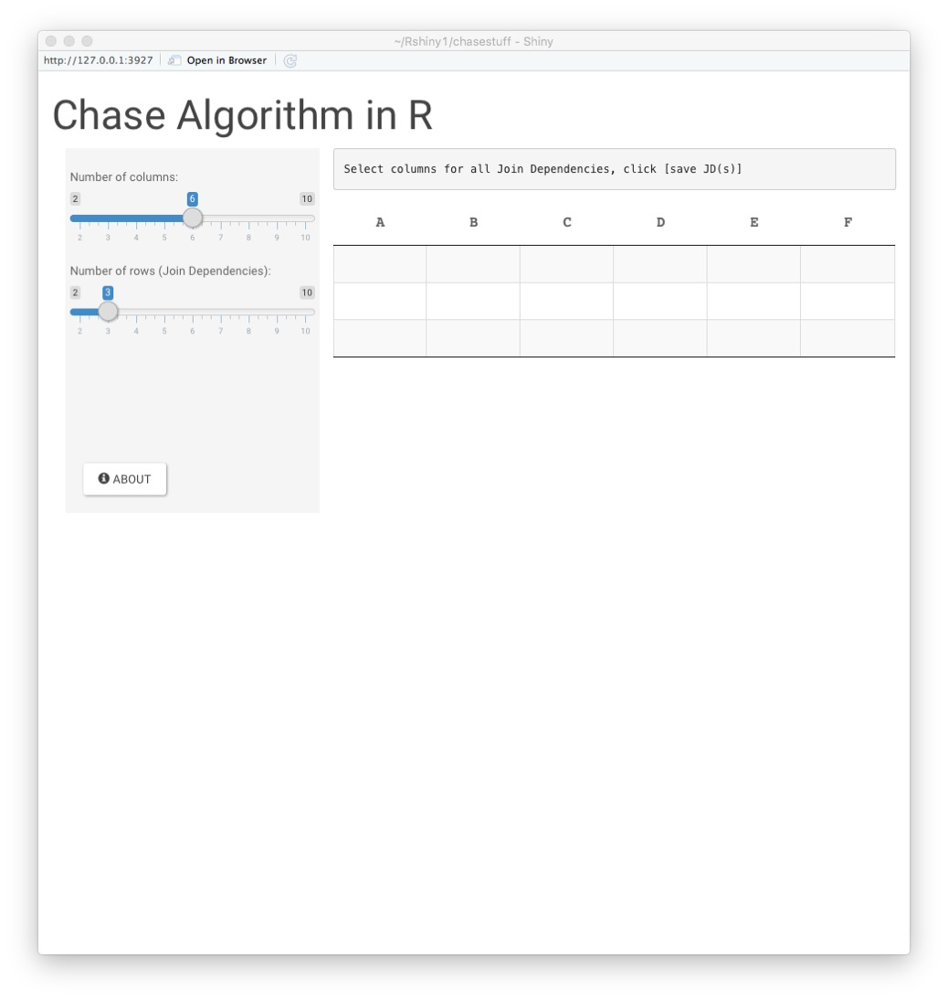
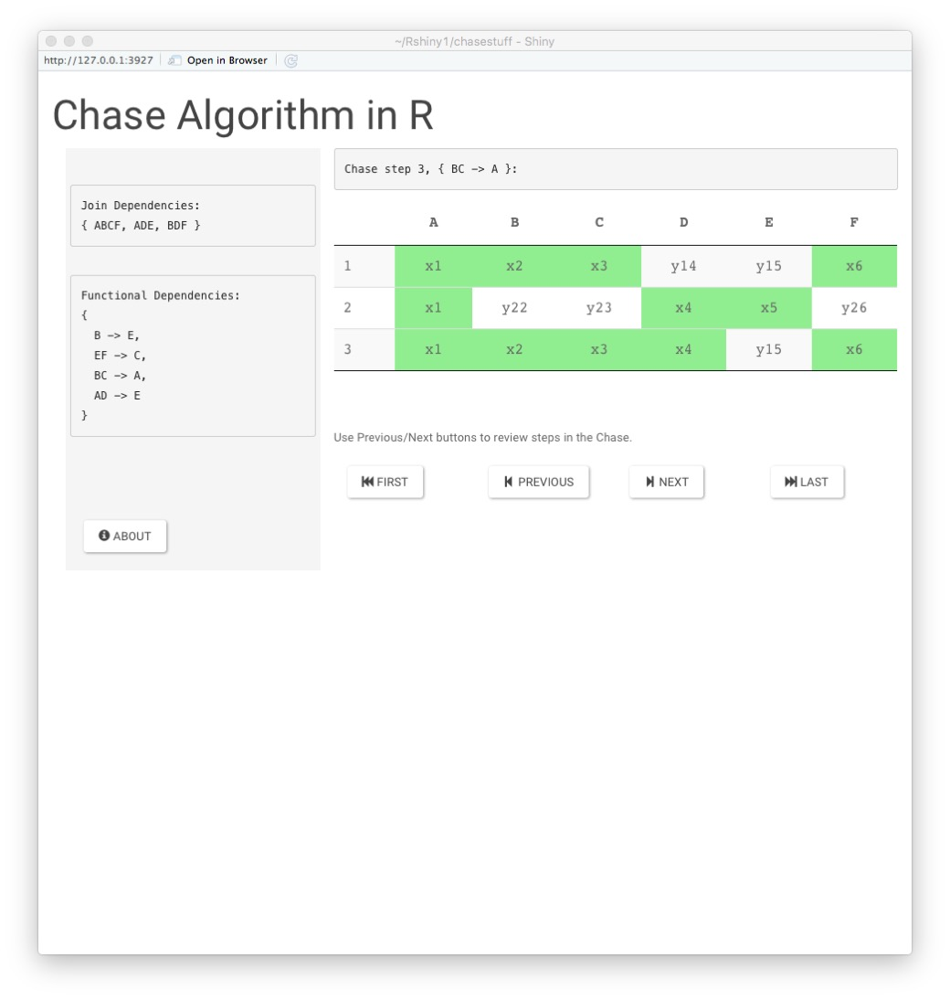

Chase Algorithm in R

Rich Cotler

March 2018

Last month I found myself wanting a challenge that was productive but
also fun. Always wanting to improve my R knowledge, I decided to write
an application that would process a basic form of the Chase Algorithm.

The application runs in R Studio or on a Shiny server. It is written in
R (developed using version 3.4.3) and requires installtion of the following CRAN libraries:

		BBmisc
		data.table
		dplyr
		DT
		lazyeval
		plyr
		purrr
		stringr
		shiny
		shinythemes
		shinyjs

The Chase Algorithm is used in relational database modeling to test for
lossless decomposition. In simple terms, it evaluates a decomposition
R1,...,Rn and its functional dependencies to see if all dependencies
have been preserved. There is an outstanding section on the Chase
Algorithm in the C. J. Date book:

Database Design and Relational Theory: Normal Forms and All That Jazz
ISBN-13: 9781449328016

I consider the entire book required reading. I adopted his attribute
notation, which I will explain in the upcoming tour of the application.
As for a deeper description of the principles of this subject, I
couldn't come close to explaining it as well as Chris Date does.

I ran across in Normalization class notes on the *Rensselaer Polytechnic
Institute* website that presented a couple of examples of the Chase
Algorithm. I will use the premise of one of the examples (Join
Dependencies, Functional Dependencies) in a tour of this application. No
other Rensselaer content was used anywhere.

THE PREMISE:

For:

R(A,B,C,D,E,F)

R1(A,B,C,F)

R2(A,D,E)

R3(B,D,F)

with functional dependencies:

{B -\> E, EF -\> C, BC -\> A, AD -\> E}

The first order of business is using the slider controls in the upper
left of the screen to set the number of columns (6 based on
R(A,B,C,D,E,F)) and number of join dependency rows (3 based on R1, R2,
and R3) needed to represent this premise.

The relations - R1(A,B,C,F), R2(A,D,E), and R3(B,D,F) are entered by
clicking the associated cells for each. When finished, press the "SAVE
JS(S)" button under the sliders.

And now the promised explanation of the notation in the cells of our new
dependency tableau. Cells with x and the column number represent the
resolved attributes, while y with row and column number are unresolved.
The chase simply applies each of the functional dependencies, changing
cells that FD resolves to the x notation.

The functional dependencies are entered in a similar fashion to the join
dependencies, but they are entered one at a time. Click the cell(s) for
the determinant and the cell for the dependent attributes and press the
"Save FD" button to store it for use and clear the FD entry tables for
the next. Notice the "START THE CHASE!" button is visible after the
first FD is saved. This button should be pressed only after all of the
FDs have been entered.

Here is how the screen looks after entering all four functional
dependencies:

Now we can push the button to "START THE CHASE". The app will apply each
of the listed functional dependencies to the dependency tableau and
present the final state of the chase.

At the end of the chase, there **must** be at least one row in the
dependency tableau with all of the cells resolved and set to the \"x\"
notation if the decomposition (R1, R2, R3) is truly lossless. Our
example completed with row 3 of our tableau verifying that given the
stated premise the decomposition is lossless.

The buttons arrayed below the dependency tableau can be used to navigate
the states of the tableau from the initial input values through each
step of the chase. For each step, including the last, the step number
and associated functional dependency applied is stated in the message
box above the dependency tableau. Here's the history of our example
chase. Note the values and cell highlight changes as each functional
dependency is applied in turn.

To start the next chase, just reload the app or browser page.

There are still many refinements that could be made to this app, but I
think it performs its core mission well and is helpful in demonstrating
how the Chase Algorithm works. I hope you enjoy using it as much as I
did creating it.
